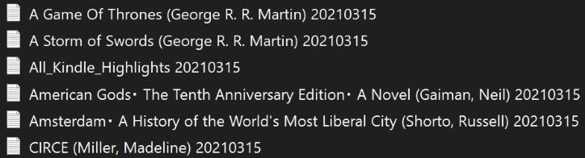
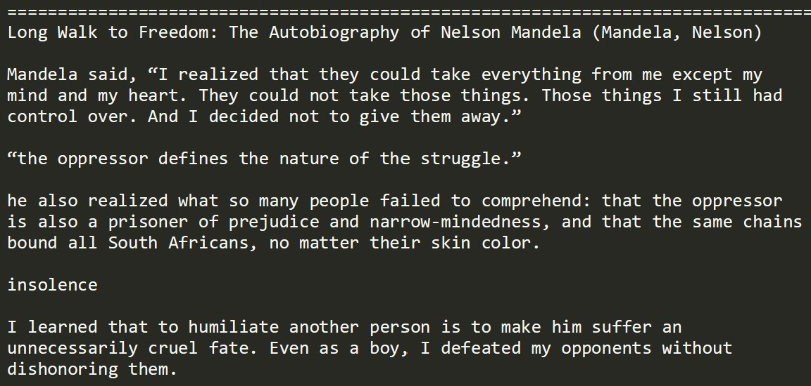

# Kynda

A microapp to consolidate and organize the highlights from your Kindle e-reader.

Due to limitations in bulk copying or sorting highlights from your Kindle, the app uses the "My Clippings" file from your kindle to group notes from the same title as well as cut out a lot of the formatting fluff like additional spacing, special characters, and the page and title being included for *every single highlight*.

The program will have two outputs:
1. A date-stamped .txt document containing all of the highlights from your Kindle, consolidated and grouped by title.
2. A date-stamped .txt file of highlights for each individual title.

*Note - You will only need one file from this repo to run the desktop version.* See 'Installation' below.

#### Example of Generated Files
<br>
#### Example of Formatted Highlights
<br>

## Use

### Prerequisites
* Ruby >= 2.5.1
* The 'My Clippings' file from your Kindle e-reader.

### Installation
To download and use the Desktop version, you will only need a single file (The rest of the repo is for an upcoming web-based version of the tool).
1. Clone this repo. [Instructions](https://docs.github.com/en/free-pro-team@latest/github/creating-cloning-and-archiving-repositories/cloning-a-repository)
1. Feel free to remove any/all files from the repo other than lib/kynda.rb
1. Move your 'My Clippings' file from your Kindle into the same directory/folder as the kynda.rb file.
    * Note - DO NOT open or edit and resave your My Clippings file before running the program. There is some *hidden* formatting that may be affected and will impact your notes.
1. From within the same directory, run ```ruby kynda.rb``` The files with your new notes will be generated within the same directory. 
